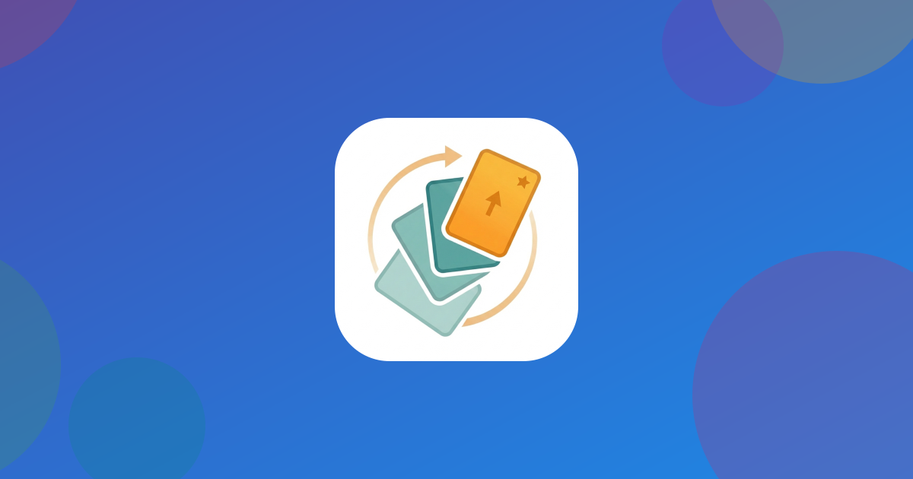

# 好好学习卡片（Good Good Study Card）

中文 | **[English](README.md)**

<p align="center">
  
</p>

<p align="center">
  <strong>用间隔重复算法，高效记住任何内容。</strong><br>
  Android · iOS · HarmonyOS · macOS · Linux
</p>

---

**好好学习卡片**是一款跨平台背单词 / 背知识卡片应用，只为一件事而生：*把记忆做扎实*。创建 Markdown 卡片、添加图片、跨平台分享卡片组——离线优先，无需账号，数据默认留在你的设备上。

## 核心功能

- **间隔重复算法，完全透明** —— 简化 SM-2 算法为每张卡片安排最佳复习时机，每个评分按钮直接显示下次间隔。
- **四种学习模式** —— 牌组学习、全局待复习、收藏夹、单卡学习，外加「新 / 学习中 / 已掌握」看板，全局进度一目了然。
- **丰富的卡片内容** —— 问题与答案均支持 Markdown，每张卡片最多 8 张图片，9 种分类颜色快速区分主题。
- **跨平台分享** —— 导出 `.ggsdeck` / `.ggscard` 文件即可在安卓、iOS、鸿蒙之间互导。无需账号，无需服务器。
- **桌面小组件** —— 主屏与锁屏小组件直接翻卡学习，无需打开应用。
- **学习统计** —— 连续学习天数、学习时长、正确率、每日活动时间线与各牌组表现。
- **离线优先 · 数据自留** —— 无需注册，数据默认只存在本机；回收站保留 30 天，误删随时可恢复。
- **三种提醒** —— 单卡定时提醒、每日学习提醒、定期备份提醒，学习节奏不断档。
- **平台专属能力** —— iOS：iCloud 同步、Siri 快捷指令；HarmonyOS：华为云备份、碰一碰分享。

## 下载

测试版以 [GitHub Releases](https://github.com/codepromax-cn/ggsc/releases) 形式发布，正式版的商店上架正在准备中。

| 平台 | 版本 | 下载 | SHA-256 |
|---|---|---|---|
| Android | `1.0-test.20260920`（测试版） | [ggsc-release-20260920.apk](https://github.com/codepromax-cn/ggsc/releases/download/v1.0-test.20260920/ggsc-release-20260920.apk) (29.1 MB) | `a66d20c8863e559e236da501888f9ee5ccdd647727ca002af3ac51b4b924be9c` |
| Linux (x64) | `1.0.0-test.20260927`（测试版） | [GoodGoodStudyCard-1.0.0-test.20260927-x64.AppImage](https://github.com/codepromax-cn/ggsc/releases/download/v1.0.0-test.20260927/GoodGoodStudyCard-1.0.0-test.20260927-x64.AppImage) (138.3 MB) | `bf4f3c46e4bf3d6cdb554803fc7556fe1e65b24685d56b84033555744071e8c6` |
| iOS | — | 即将上线 | — |
| HarmonyOS | — | 即将上线 | — |
| macOS | — | 开发中 | — |

**安装说明**

- **Android**：APK 未通过 Play 商店分发——安装时按提示允许浏览器「安装未知应用」即可。
- **Linux**：为 AppImage 添加可执行权限后运行：
  ```bash
  chmod +x GoodGoodStudyCard-1.0.0-test.20260927-x64.AppImage
  ./GoodGoodStudyCard-1.0.0-test.20260927-x64.AppImage
  ```

## 截图

<!-- 将应用截图放入 docs/ 后取消注释：
<p align="center">
  
  
  
</p>
-->

## 官网与牌组广场

访问 **[ggscard.cn](https://ggscard.cn)** —— 项目官网：

- 浏览**牌组广场**，下载 `.ggsdeck` 文件，或直接输入短 ID（如 `AB3X9K`）把整组卡导进应用。
- 中英文**图文教程**，覆盖每一个功能。
- 浏览器里直接**在线试用**真实的学习交互——装之前先试试。

## 关于本仓库

本仓库托管好好学习卡片的**发布文件与版本说明**。每个测试版都是一个带校验和的标签发布（`v<版本号>`）。产品官网、牌组广场与文档请访问 [ggscard.cn](https://ggscard.cn)。
